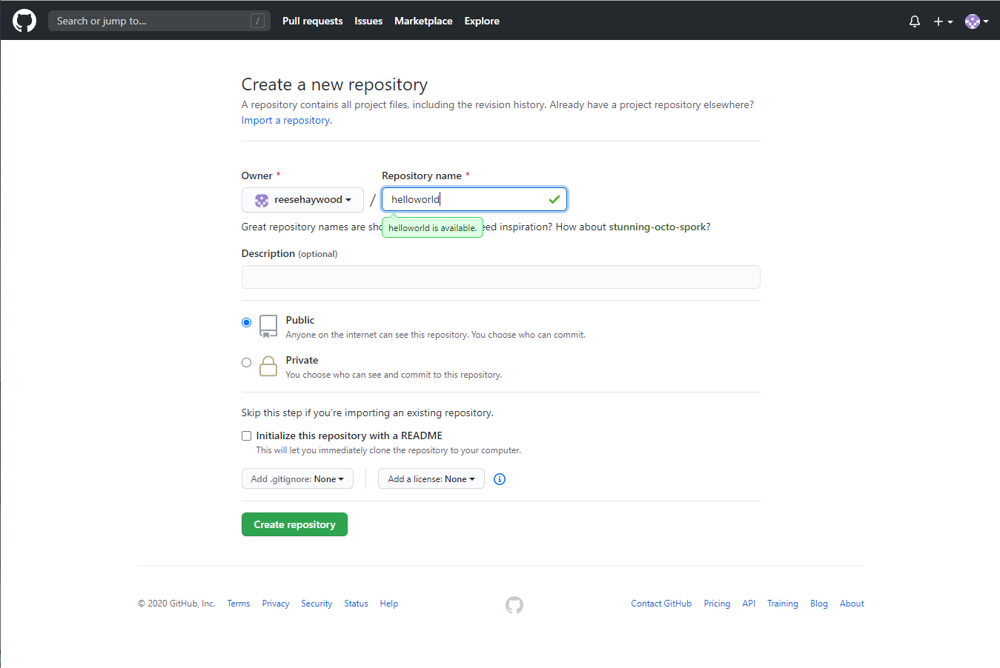

# Notes on using Github

The easiest way to get the commands needed for initializing and using a git repository are to just create a new empty repository. Do not select any of the options. Then, on the local computer:

```
git clone 'https://github.com/username/project'
```

## Create a new repository

Press the green new button.


Do not select any options. This will create an empty repo.

